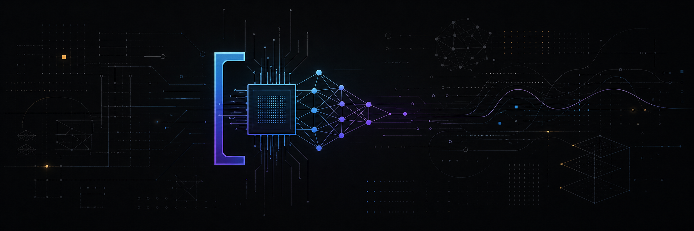

<div align="center">
  

  <h1>OpenComputeAI</h1>

  <p><code>SYSTEMS &times; MATHEMATICS &times; INTELLIGENCE</code></p>

  <p>
    Open engineering and education for people who want to understand<br />
    how computers and artificial intelligence work from first principles.
  </p>
</div>

---

## The premise

Modern AI is not magic. It is a stack of ideas, abstractions, and engineered systems. OpenComputeAI makes that stack visible.

We create technical books, laboratories, reference implementations, simulations, and reproducible experiments that connect foundational theory to working software. Every resource is designed to answer three questions:

```text
01  What is the underlying principle?
02  How is it implemented in a real system?
03  What happens when we measure it?
```

## The stack

```text
                         AI INFRASTRUCTURE
                       /                   \
              LARGE LANGUAGE MODELS    DISTRIBUTED SYSTEMS
                     /                           \
            DEEP LEARNING                 OPERATING SYSTEMS
                  /                              \
         MACHINE LEARNING                 COMPUTER ARCHITECTURE
                /                                \
          MATHEMATICS  <---- algorithms ---->  PROGRAMMING
                \                                /
                 +------ bits · bytes · data ---+
```

Our work moves through the entire computing stack—from binary representation and processor architecture to machine learning, large language models, and production AI infrastructure.

## What we build

| Domain | Output | Objective |
| :--- | :--- | :--- |
| Computer systems | Books, labs, and simulations | Make hardware and software abstractions concrete |
| Mathematics for AI | Visual explanations and implementations | Connect equations to executable intuition |
| AI engineering | Reference code and practical guides | Turn models into reliable systems |
| LLM engineering | Experiments and system patterns | Explain how modern language-model applications work |
| AI infrastructure | Architecture studies and tooling | Explore performance, scale, and operational trade-offs |

## The method

```text
understanding = theory + implementation + measurement

while knowledge.is_incomplete():
    model = derive(first_principles)
    system = implement(model)
    evidence = measure(system)
    knowledge = refine(evidence)
```

We make assumptions explicit, build the idea, observe its behavior, and revise our understanding. The result is knowledge that transfers across languages, frameworks, and technology cycles.

## Current focus

```text
CS.101   Computer Systems for AI Engineers
LAB.001  Computer Systems Laboratory
MATH.210 Mathematics for Artificial Intelligence
LLM.301  Large Language Model Engineering
INF.401  AI Infrastructure
EXP.001  Reproducible AI Engineering Experiments
```

## Built for

Students, software engineers, AI engineers, researchers, educators, and open-source contributors who are willing to look beneath the abstraction and ask how the system actually works.

No single background is required. Start with what you know; build the rest one layer at a time.

## Contributing

OpenComputeAI welcomes contributions to documentation, source code, laboratories, diagrams, simulations, tests, and educational material.

Strong contributions are technically sound, reproducible, clearly explained, and accessible to learners. Before beginning substantial work, review the relevant repository documentation and open a discussion to align the proposal with the project direction.

---

<div align="center">
  <p><code>LEARN DEEPLY&nbsp;&nbsp;/&nbsp;&nbsp;BUILD OPENLY&nbsp;&nbsp;/&nbsp;&nbsp;SHARE KNOWLEDGE</code></p>
  <sub>Open knowledge. Better systems. Smarter AI.</sub>
</div>
